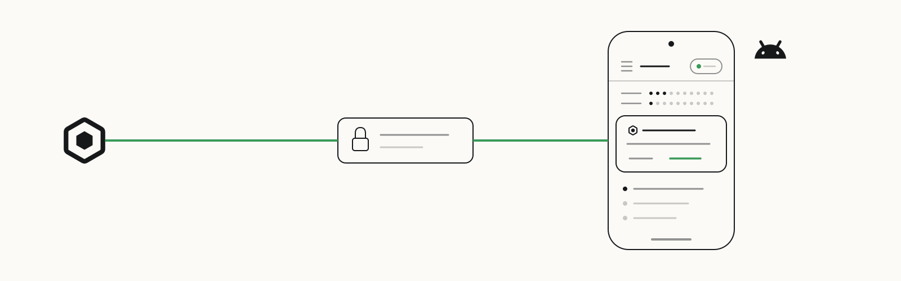
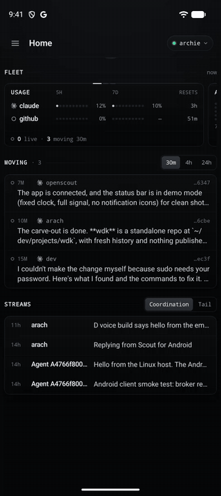
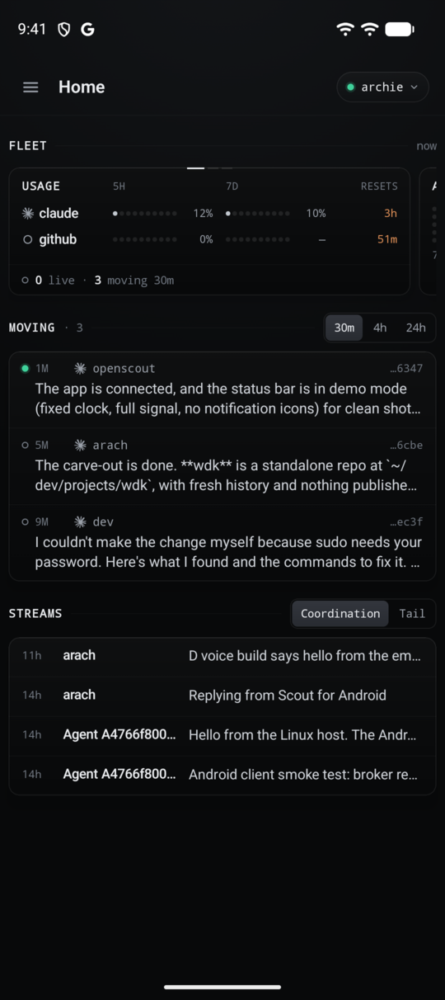
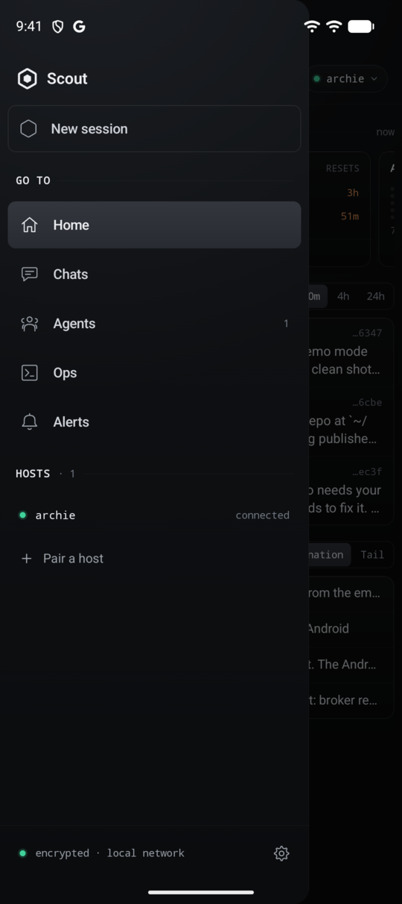
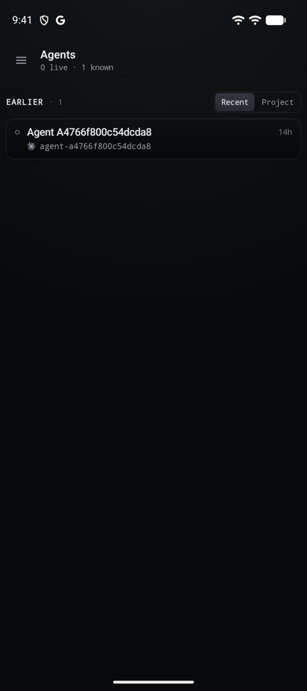
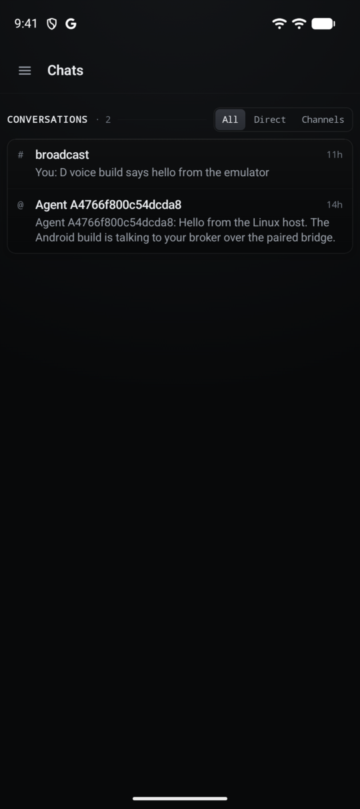
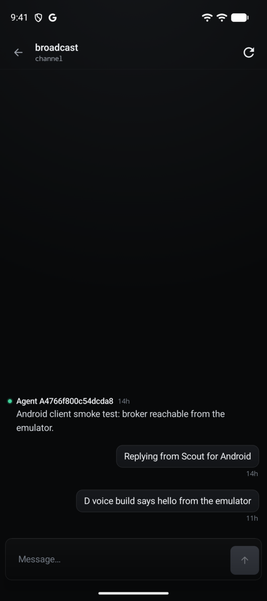
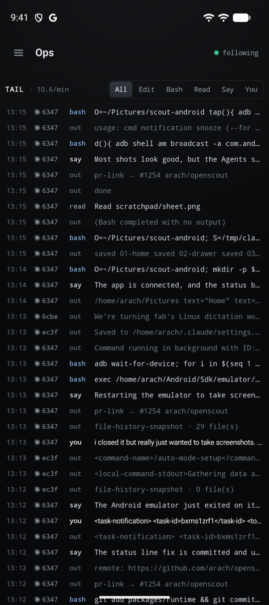
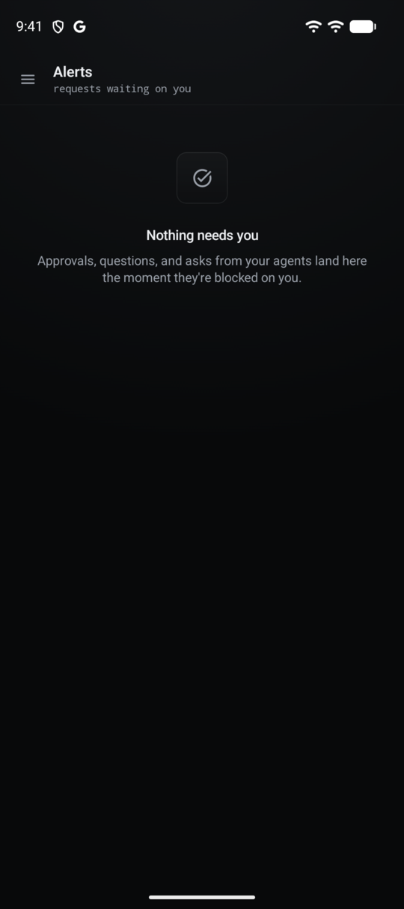
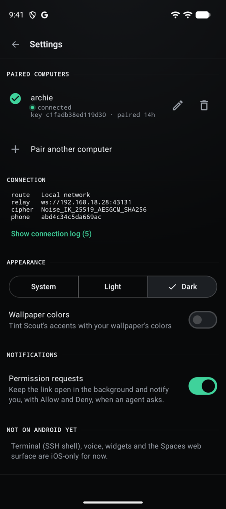

<p>
  <a href="https://openscout.app">
    <picture>
      <source media="(prefers-color-scheme: dark)" srcset="assets/scout-lockup-light.svg" />
      
    </picture>
  </a>
</p>

# Scout for Android

Your agents in your pocket: see what's moving, chat with agents, and approve permission requests from your phone.

[OpenScout](https://openscout.app) · [Build](#build-install-run) · [How it connects](#how-it-connects) · [All integrations](https://github.com/oscout)

<!-- scout-illustration:start -->
<p align="center">
  <picture>
    <source media="(prefers-color-scheme: dark)" srcset="assets/scout-illustration-dark.svg" />
    
  </picture>
</p>
<p align="center"><em>Your agents in your pocket: approve a permission request without leaving the notification.</em></p>
<!-- scout-illustration:end -->

The Android counterpart to Scout for iOS: a native mobile
surface for the broker/runtime running on your computer. It pairs with the
computer's pairing bridge exactly like iOS does (same QR payload, same
`scout://pair` link, same Noise handshake, same tRPC procedures) and holds no
broker logic of its own.

<p align="center"></p>

| Home | Drawer | Agents | Chats |
|---|---|---|---|
|  |  |  |  |
| **Thread** | **Ops** | **Alerts** | **Settings** |
|  |  |  |  |

- Kotlin + Jetpack Compose + Material 3, single activity, edge-to-edge, light/dark
- Package id `app.openscout.scout` (`.debug` suffix for debug builds), mirroring
  the iOS bundle id
- `compileSdk`/`targetSdk` 37, `minSdk` 28
- Gradle Kotlin DSL, version catalog (`gradle/libs.versions.toml`), wrapper checked in

Apache 2.0 (see `LICENSE`). The app builds on its own: `./gradlew assembleDebug`
needs only the Android SDK. It talks to the pairing bridge from
[OpenScout](https://openscout.app), which runs on your computer. The dev
tools and the interop test below use OpenScout's own Noise code, so they need an
OpenScout checkout: set `OPENSCOUT_DIR` to it, or run them from inside the
monorepo, where this app lives as `apps/android`.

## What's in it

| Screen | What it shows | Bridge procedures |
| --- | --- | --- |
| Pair | QR scan (CameraX + ZXing), paste a pairing link, deep links | relay + Noise XX |
| Home | Link signal panel, counts, "Needs you", activity, projects | `mobile.home`, `mobile.activity`, `mobile.inbox` |
| Chats | DMs and channels, unread badges, filters | `mobile.commsConversations` |
| Thread | Messages, composer, optimistic send, mark read, live refresh | `mobile.commsMessages`, `mobile.commsSend`, `mobile.sendMessage`, `mobile.commsMarkRead` |
| Agents | Ledger (Recent / By project), attention, liveness | `mobile.agents` |
| Agent | Runtime/project facts, recent activity, Message, Interrupt | `mobile.activity`, `mobile.agentInterrupt` |
| Tail | Polled harness firehose (3s while visible), kind/project filters, pause | `mobile.tail` |
| Alerts | Approvals, questions, asks, terminal prompts, with actions | `mobile.inbox`, `actionDecide`, `questionAnswer`, `mobile.commsSend` |
| New session | Pick a project + ready harness + optional first message | `mobile.createSession` |
| Settings | Paired computers (switch/rename/forget), connection log, appearance | — |

The UI speaks the iPhone's current voice, "D · web voice"
(`design/studio/views/ios-calmer-surfaces.tsx`) with Home from "Home, denser"
round II (`ios-home-dense.tsx`); the design canvas lives in the "Scout for
Android" Claude Design artifact. A near-black ground lit from above with a
little grain, 0.5dp low-alpha hairlines, boxes lit along their top edge, caps
mono section labels on a long rule, harness marks, raised-plate selection
(`ios-soft-selection.tsx`), and color kept for state. Navigation is a drawer
(Home, Chats, Agents, Ops, Alerts, hosts, Settings), not a tab bar. Dark is the
default; Light and System are in Settings.

- `ui/theme/Theme.kt` holds the tokens (`Scout.colors`), and maps Material's
  scheme onto them so stock components sit in the same room.
- `ui/components/Kit.kt` is the kit: `LitBox`, `SectionHead`, `Lamp`,
  `Segmented`, `DotMeter`, `HarnessMark`, `BranchPill`, `Tag`, `Glyph`.
- Home's cockpit reads `mobile.serviceBudgets` (usage dot meters),
  `mobile.heartrate` (the 7-day activity dots), `mobile.inbox` (waiting on you),
  `mobile.tail` in `assistant-replies` mode (Moving, built like iOS
  `HomeMovingSessions`), and `mobile.fleet` activity (Coordination).

## Build, install, run

```bash
./gradlew assembleDebug          # app/build/outputs/apk/debug/app-debug.apk
./gradlew testDebugUnitTest      # Noise (incl. interop with the bridge's TS responder) + pairing payload tests
./gradlew lintDebug
./gradlew installDebug           # onto the running emulator / connected device
adb shell am start -n app.openscout.scout.debug/app.openscout.scout.MainActivity
```

Needs JDK 17+ (21 used here) and an Android SDK with `platforms;android-37.0`
and `build-tools;37.0.0`. Point Gradle at the SDK with `ANDROID_HOME` or a
`local.properties` containing `sdk.dir=...` (gitignored).

## How it connects

```
phone ──ws──► pairing relay (:43131) ◄──ws── bridge (:43130) ──► broker (:43110)
        Noise XX (first pair) / IK (reconnect), tRPC JSON-RPC inside
```

1. **Pair.** The QR (or `scout://pair?payload=…`, or an
   `https://openscout.app/pair#payload=…` link, or the raw JSON) carries the
   relay URLs, room, bridge public key, and expiry. The app opens
   `<relay>?room=<room>&role=client`, runs Noise XX as initiator, and trusts the
   bridge only if the learned static key matches the payload's key.
2. **Reconnect.** On launch/foreground the app asks the relay for the bridge's
   current room (`POST /resolve`), then runs Noise IK against the saved key.
   Routes are tried in order, and the one that wins is promoted. It backs off
   1s → 30s while unreachable, and drops the socket when backgrounded, unless
   background permission requests are on (below).
3. **Talk.** Every call is a tRPC envelope (`{id, jsonrpc, method, params:{path,input}}`)
   encrypted on the channel. Pushed `mobile:conversation:changed` and
   `operator:notify` frames refresh chats and alerts live.

4. **Permission requests in the background.** Opt-in from Settings →
   Notifications. `ApprovalWatchService` (a `specialUse` foreground service)
   holds the link open while the app is out of sight, and `ApprovalNotifier`
   turns each `operator:notify` into a notification. Approvals get Allow and
   Deny actions that call `actionDecide` through `ApprovalActionReceiver`
   without opening the app. After a dropped link it catches up from
   `mobile.inbox`, and requests answered elsewhere are taken down. There is no
   FCM path, so with the setting off nothing arrives in the background.

The phone's X25519 identity is sealed with an Android Keystore AES key; trusted
bridges and relay routes are stored in private preferences.

## Local development against this machine's broker (emulator)

The emulator can't scan a QR off your monitor, so hand it the live pairing
payload over adb instead:

```bash
# in an OpenScout checkout, once: bun install
bun packages/runtime/src/broker-daemon.ts &              # broker on :43110 (skip if already running)
bun packages/web/server/pairing-runtime-controller.ts &  # relay :43131 + bridge :43130, writes ~/.scout/pairing/runtime.json

# then, in this app's directory
./gradlew installDebug
scripts/pair-emulator.sh            # opens scout://pair?payload=… in the app
```

`pair-emulator.sh` reads `~/.scout/pairing/runtime.json` (the same payload the QR
encodes) and fires the deep link with `adb shell am start`. Inside the emulator
the app tries the advertised relay first (your LAN or tailnet address, NATed by
the emulator), then adds `ws://10.0.2.2:<relay port>` as a fallback. On the
API 37 image used here, the app's default (virtual Wi-Fi) network could not
reach 10.0.2.2 even though `adb shell` could, so the LAN route is what connects.

For a **USB device**, `scripts/pair-emulator.sh --reverse` runs
`adb reverse tcp:43131 tcp:43131` and puts `ws://127.0.0.1:43131` first. On a
real phone you can also just scan the QR from `scout pair` or the Mac app.

To seed something to look at, `scout broadcast "hello"` and
`scout notify --message "hi"` create a channel and an operator DM.

## Dev tools

- `tools/noise-responder.ts` drives the bridge's own Noise responder over
  stdin/stdout; `NoiseInteropTest` runs the phone's initiator against it (XX and
  IK). Needs bun and an installed OpenScout checkout (`OPENSCOUT_DIR`, or the
  enclosing monorepo), otherwise the test is skipped.
- `bun tools/bridge-probe.ts [path …]` pairs with the local bridge
  as a throwaway phone and prints `mobile.*` replies, to check wire shapes.

## Not done yet

- Terminal (SSH shell into the device-scoped tmux workspace), voice, the
  World/Deck/Mesh scenes, and the Spaces web surface
- Real push (the Push Relay is APNs-only today; background requests need the
  opt-in held link above), and widgets
- LAN pair-request discovery (Bonjour/beacon "Choose a Mac") and OpenScout
  Network rendezvous. Pairing is QR, link, or deep link only.
- Rich session transcripts (`mobile.sessionSnapshot` turns/blocks, tool calls,
  approvals inline). Threads render broker messages as plain text.
- Attachments (upload/fetch) and markdown rendering in messages
- Multi-host fleet read scope. One active computer at a time; switch in Settings.
- Release signing and a Play Store listing
